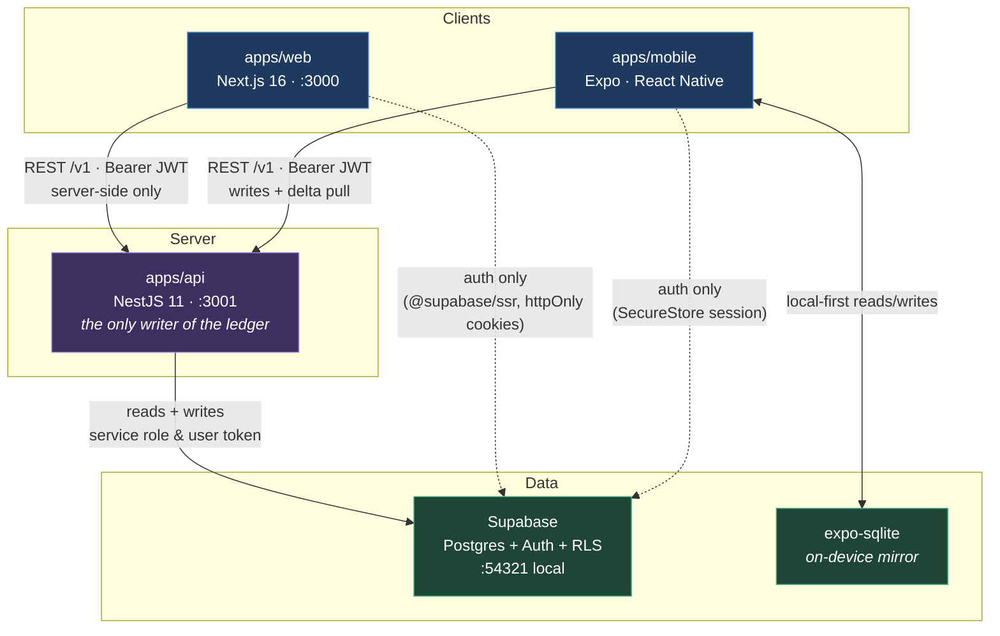
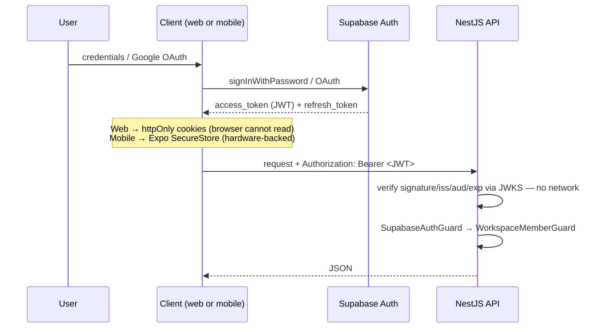
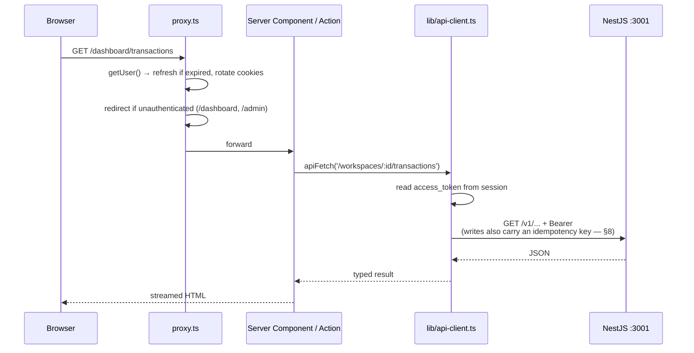
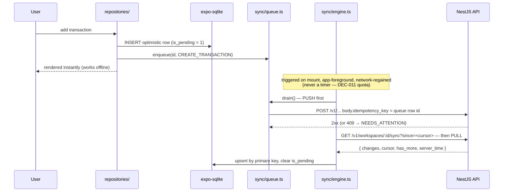

# NoorixFin — Architecture

A map of the repository for new developers and auditors: what each folder is, how
the three applications communicate, and where the rules that protect the ledger
actually live.

This document describes **verified, present behaviour** — every route, port, and
dependency below was read out of the source, not out of a plan. Where the code and
its own documentation disagree, that is called out in
[Known inconsistencies](#12-known-inconsistencies) rather than smoothed over.

For product requirements and the numbered decision log (`DEC-0xx`, `Blueprint §x`)
that the source comments reference, see
[`NoorixFin_Production_Blueprint.md`](NoorixFin_Production_Blueprint.md) and
[`memory/DECISIONS.md`](memory/DECISIONS.md).

---

## 1. System at a glance

Three clients, one API, one database. The API is a **modular monolith** (NestJS)
and the single writer of financial data.



The two dotted lines are the important nuance: **clients talk to Supabase for
authentication only.** No client writes financial rows directly. Section 5
explains why.

---

## 2. Repository layout

A pnpm + Turborepo workspace. `pnpm-workspace.yaml` declares exactly two globs:
`apps/*` and `packages/*`.

```
NoorixFin/
├── apps/                       # Deployable applications
│   ├── api/                    # NestJS REST API — the system of record
│   │   ├── src/
│   │   │   ├── main.ts         # Bootstrap: /v1 versioning, CORS, validation, Swagger
│   │   │   ├── app.module.ts   # Module graph + global guards/filters/interceptors
│   │   │   ├── auth/           # JWT verification, @Public(), workspace-member guard
│   │   │   ├── supabase/       # Supabase client provider (service-role + user-token)
│   │   │   ├── common/         # Cross-cutting: request-id, error filter, throttling
│   │   │   ├── observability/  # system_events feed behind the admin monitoring UI
│   │   │   ├── sync/           # Delta-sync endpoint for the mobile app
│   │   │   ├── health/         # Public liveness probe
│   │   │   │
│   │   │   ├── profiles/       # /v1/me            — identity & preferences
│   │   │   ├── account/        # /v1/me/*          — the USER'S OWN account
│   │   │   ├── accounts/       # /v1/workspaces/*  — FINANCIAL accounts
│   │   │   ├── workspaces/     # Tenant container + summary
│   │   │   ├── transactions/   # Double-entry postings, reversal, tags
│   │   │   ├── categories/     # Category tree
│   │   │   ├── planning/       # Budgets, goals, calendar, recurring, reports
│   │   │   └── admin/          # Operator surface behind SuperAdminGuard
│   │   └── test/               # e2e config and stubs
│   │
│   ├── web/                    # Next.js 16 App Router (SSR)
│   │   ├── src/
│   │   │   ├── proxy.ts        # Session refresh + route protection (NOT middleware.ts)
│   │   │   ├── app/            # Routes: (marketing), auth, onboarding, dashboard, admin
│   │   │   ├── components/     # Shared React components
│   │   │   └── lib/
│   │   │       ├── api-client.ts   # server-only fetch wrapper → NestJS
│   │   │       ├── session.ts      # Cached session + profile per render
│   │   │       ├── supabase/       # @supabase/ssr browser & server clients
│   │   │       └── i18n/           # Next-specific adapter over @noorixfin/i18n
│   │   └── e2e/                # Playwright specs
│   │
│   └── mobile/                 # Expo React Native, offline-first
│       ├── app/                # expo-router screens (_layout, index, sign-in)
│       └── src/
│           ├── db/             # expo-sqlite schema + upsert helpers
│           ├── repositories/   # Local-first data access
│           ├── sync/           # engine.ts (push→pull), queue.ts (durable outbox)
│           └── lib/            # api.ts (→ NestJS), supabase.ts (SecureStore session)
│
├── packages/                   # Shared, versioned internal libraries (§3)
│   ├── domain/                 # Framework-free types & enums — the shared vocabulary
│   ├── money/                  # Minor-unit arithmetic & double-entry balance check
│   ├── i18n/                   # Translation catalogs + typed translator
│   ├── design-tokens/          # THE palette — generates tokens.css for web
│   ├── ui/                     # Shared React components (nx-*), Storybook
│   ├── observability/          # Release id, error fingerprints, redaction, tracing
│   ├── db-types/               # Types GENERATED from the live schema
│   ├── api-client/             # Placeholder for generated OpenAPI client
│   └── test-fixtures/          # Shared test data builders
│
├── supabase/                   # Database as code — the real schema owner
│   ├── migrations/             # 21 ordered SQL migrations (RLS, ledger, triggers)
│   ├── tests/                  # SQL invariant tests (tenant isolation, ledger)
│   ├── seed.sql                # Local dev seed
│   └── config.toml             # Local stack ports & auth providers
│
├── infra/docker/               # Deployment notes
├── memory/                     # Engineering log: decisions, progress, audit, blockers
├── .github/workflows/ci.yml    # 3-job pipeline (§11)
│
├── pnpm-workspace.yaml         # Workspace globs + build allowlist
├── turbo.json                  # Task graph and cache outputs
├── tsconfig.base.json          # Strict TS options inherited by every package
├── .env.example                # The full environment contract (§10)
└── ARCHITECTURE.md             # This file
```

> **Naming trap worth knowing on day one.** `apps/api/src/account/` and
> `apps/api/src/accounts/` are **different domains**, not a duplicate:
>
> | Folder | Serves | Routes |
> |---|---|---|
> | `account/` | The signed-in **user's own** account — data export, deletion requests, broadcast dismissal | `/v1/me/*`, `/v1/settings/public` |
> | `accounts/` | **Financial** accounts — bank, cash, wallet, and their balances | `/v1/workspaces/:workspaceId/accounts` |

---

## 3. Shared packages — who owns what

Everything here is `private: true` and consumed via `workspace:*`, so there is no
publish step. Most build to `dist/` with `tsc`; two are consumed straight from
source.

| Package | Purpose | Consumed by | Resolution |
|---|---|---|---|
| `@noorixfin/domain` | Framework-free types & enums (~36 exports). The shared vocabulary — no runtime deps, so API and clients cannot drift. | api, mobile, test-fixtures | `dist/` |
| `@noorixfin/money` | Minor-unit integer arithmetic, currency metadata, formatting, and `validateBalance()` for double-entry. | api, web, mobile | `dist/` |
| `@noorixfin/i18n` | **All** translation catalogs (`locales/{en,bn}/{common,errors}.json`) plus a typed `createTranslator()`. Keys are typed from the English catalog, so a missing key is a compile error. | web, mobile | `dist/` |
| `@noorixfin/design-tokens` | **The** palette, spacing, type and elevation scales. Generates `tokens.css` (74 custom properties) which the web app imports — so a colour is decided in one place. Scales exist twice, numeric for React Native and `rem` for CSS, derived from one source. | web | `dist/` + `tokens.css` |
| `@noorixfin/ui` | Shared React components (`Button`, `Input`, `Card`, `Badge`, `Table`, `EmptyState`, `Skeleton`, `ConfirmDialog`). Every value in `ui.css` is a token `var()`. Documented in Storybook; 17 component tests assert the accessibility wiring. | web | source |
| `@noorixfin/db-types` | TypeScript types **generated** from the live Postgres schema (`pnpm generate`). Never hand-edit. | api | `dist/` |
| `@noorixfin/observability` | Release identity, stable error **fingerprints**, redaction, and W3C trace context. Vendor-neutral: the default reporter is a no-op, so nothing leaves the system until someone registers one. | api, web, mobile | `dist/` |
| `@noorixfin/test-fixtures` | Shared test-data builders. | (test scopes) | source |
| `@noorixfin/api-client` | **Types generated from the API's own OpenAPI document** (`src/schema.d.ts`, 51 paths) plus helpers for looking up a route's response, body and params. Deliberately not a transport — see below. | web | source |

**Design values are centralised in `packages/design-tokens`.** They were not,
and the consequence is worth recording: the tokens package declared a primary of
`#0DAB76`, `globals.css` declared `#10b981`, `marketing.css` declared a third
set, the mobile app hardcoded a fourth — and **nothing imported the tokens
package at all**, so no type error, failing test or broken build could reveal
it. The values now generate into `tokens.css`, and
`packages/design-tokens/src/tokens.test.ts` fails if a stylesheet starts
declaring its own again.

Regenerate after changing a token:

```bash
pnpm --filter @noorixfin/design-tokens generate
```

Browse the components:

```bash
pnpm --filter @noorixfin/ui storybook
```

**Translations are centralised in `packages/i18n`.** `apps/web/src/lib/i18n/` is
*not* a second copy — it is a thin Next.js adapter (a `server-only` cookie/profile
resolver and a React context provider) that both resolve through the shared
package, so a string rendered on the server and one rendered on the client cannot
disagree. Mobile consumes the same package through `react-i18next`.

**Locale parity is enforced in CI**: `pnpm --filter @noorixfin/i18n check:keys`
fails the build if `bn` and `en` drift apart.

---

## 4. Authentication — one identity, two session strategies

Supabase Auth issues the JWT. The API **verifies it locally** via JWKS and never
calls the Auth server per request (`auth/jwt-verifier.service.ts`, DEC-011) — that
round trip was the largest avoidable source of API calls in the system.



The two session strategies are a deliberate split, not an inconsistency:

| | Web | Mobile |
|---|---|---|
| Token storage | `httpOnly` cookies via `@supabase/ssr` | Expo SecureStore (keychain/keystore) |
| Can the client read the token? | **No** — so it cannot call the API directly | Yes |
| Refresh trigger | `apps/web/src/proxy.ts` calls `getUser()` before every matched request | supabase-js `autoRefreshToken` |
| Rationale | No XSS surface can exfiltrate a token | No address bar / XSS surface; and an offline app must prove identity with no server round trip |

> **`apps/web/src/proxy.ts`, not `middleware.ts`.** Next.js 16 renamed the
> convention; the export is `proxy`. Server Components cannot set cookies, so if
> this file stops running, sessions silently stop refreshing.

---

## 5. The central rule: NestJS is the only writer

Both clients hold a valid Supabase token and *could* insert rows directly. They
must not, and neither does.

A transaction is a **balanced double-entry posting**: a `journal_entry` plus
`journal_postings` that sum to zero. A client that inserted the entry without its
balancing postings would produce a corrupt ledger that no client-side code could
detect. Only the API enforces balance, idempotency, optimistic-concurrency
version checks, and the audit trail.

So the rule (DEC-005, DEC-010), stated as the mobile client's own comment puts it:
**pull from Supabase, push through the API.**

| Path | Allowed | Notes |
|---|---|---|
| Client → Supabase Auth | ✅ | Sign-in and token refresh only |
| Client → API → Postgres | ✅ | Every financial read and write |
| Client → Postgres (write) | ❌ | Would bypass balance, idempotency and audit |
| Mobile → local SQLite | ✅ | Optimistic mirror; reconciled by the sync engine |

Defence is layered, so a bug in one tier is not a breach:

1. **CORS** — strict origin allowlist (`main.ts`).
2. **`SupabaseAuthGuard`** — global; opt out per route with `@Public()`.
3. **`IdentityThrottlerGuard`** — rate limits keyed on the *authenticated user*, not the IP (tiers: 10/s, 100/min, 1000/hr).
4. **`ValidationPipe`** — `whitelist` + `forbidNonWhitelisted`, so unknown fields are rejected rather than ignored.
5. **`WorkspaceMemberGuard`** — proves membership of `:workspaceId`. **`SUPER_ADMIN` does not bypass it** — operators get metadata via dedicated admin endpoints, never ambient access to a user's ledger (DEC-007, DEC-013).
6. **Postgres RLS** — the final backstop, tested by SQL invariants in `supabase/tests/`.

---

## 6. Web data flow (server-rendered)

Because the token lives in an `httpOnly` cookie, **the browser never calls the API
directly.** Client Components reach it through Server Components and Server
Actions, which call the `server-only` `apiFetch`.



Details that matter when debugging:

- **`/v1` is added by the client.** Callers pass `/workspaces/...`; `apiFetch` requests `${API_URL}/v1${path}`. Don't pass the prefix yourself.
- **`cache: 'no-store'` by default** — financial data is never stale-safe.
- **10-second timeout.** A *hung* API (connection accepted, no answer) would otherwise stall the whole server render into a blank tab; the timeout converts it into an `ApiError` with `isUnreachable`, which callers render as a degraded-but-branded page. CI exercises this in a dedicated "API unreachable" Playwright run.
- **`getSession()` in `api-client.ts` is not an authorization decision** — it only lifts the raw token to forward. Authorization uses `getUser()`, and the API re-verifies the signature regardless.

---

## 7. Mobile data flow (offline-first)

Writes land in **SQLite first** and render immediately; a durable outbox drains
them to the API in the background. The queue is a *table*, not memory, so a write
the user believes is saved survives the app being killed.



The four invariants this design protects — each covered by a test in
`apps/mobile/src/sync/engine.test.ts` (13 tests, run against real SQLite and the
real queue SQL; only the native binding and the network are substituted):

1. **Push before pull.** Otherwise a pull overwrites the optimistic local row with the server's older copy, and a transaction the user just entered flickers away and comes back.
2. **Idempotency.** The queue row's own id is sent as `idempotency_key` and reused across *every* retry — so a retried write cannot double-post. The same id is the optimistic local row's id, which is what lets the two be reconciled.
3. **At-least-once pull.** Boundary rows may repeat, so the client upserts by primary key and only advances its cursor when `has_more` is `false`.
4. **Failures surface, never silently merge.** Server wins on pull. A rejected push is parked as `NEEDS_ATTENTION` with its reason rather than merged — on money, a visible prompt beats a silent merge. One bad row must not block later writes behind it; retries use exponential backoff with jitter.

**Why sync is one endpoint.** `GET /workspaces/:id/sync` returns every change
across the workspace in one round trip. Supabase Realtime is used only as a
*payload-free hint* that something changed — which keeps financial data off the
Realtime transport and egress down (DEC-011).

---

## 8. API surface (`/v1`)

URI versioning, `defaultVersion: '1'` — so every route below is prefixed `/v1`.
Live OpenAPI UI: **`http://localhost:3001/api/docs`**.

The three **`/health*`** probes are the only unauthenticated routes (the only
`@Public()` handlers in the codebase). Everything else requires
`Authorization: Bearer <JWT>`, and routes under `workspaces/:workspaceId`
additionally pass `WorkspaceMemberGuard`.

> A probe that needs a token is a probe that fails during the incident it
> exists to detect, which is why these three are public and why `/health/ready`
> reports dependency *status* without leaking dependency *contents*.

### Identity & account

| Method | Path | Purpose |
|---|---|---|
| `GET` | `/health` | Liveness probe — touches no dependency |
| `GET` | `/health/live` | Alias of the above, under the conventional name |
| `GET` | `/health/ready` | Readiness — probes database and auth, and answers **503** when either fails or the process is draining |
| `GET` | `/settings/public` | Global settings any **signed-in** user may read (maintenance mode, signups open, version, support address). "Public" here means *non-operator*, **not** unauthenticated — private operator settings are excluded by RLS. |
| `GET` | `/me` | Current profile |
| `PATCH` | `/me/preferences` | Update preferences (locale lives here) |
| `PATCH` | `/me/onboarding` | Advance onboarding state |
| `GET` | `/me/export` | Full data export (rate-limited) |
| `POST` | `/me/deletion-request` | Request account deletion |
| `DELETE` | `/me/deletion-request` | Cancel that request |
| `GET` | `/me/broadcasts` | Broadcasts targeted at this user |
| `POST` | `/me/broadcasts/:broadcastId/dismiss` | Dismiss one |

### Workspaces, accounts & categories

| Method | Path | Purpose |
|---|---|---|
| `POST` · `GET` | `/workspaces` | Create · list |
| `GET` | `/workspaces/:workspaceId/summary` | Dashboard rollup |
| `POST` · `GET` | `/workspaces/:workspaceId/accounts` | Create · list with balances |
| `PATCH` | `/workspaces/:workspaceId/accounts/:id` | Update / archive |
| `GET` · `POST` | `/workspaces/:workspaceId/categories` | List · create |
| `PATCH` | `/workspaces/:workspaceId/categories/:id` | Update |

### Transactions (double-entry)

| Method | Path | Purpose |
|---|---|---|
| `POST` | `/workspaces/:workspaceId/transactions` | Create — requires `Idempotency-Key` |
| `GET` | `/workspaces/:workspaceId/transactions` | List / filter |
| `GET` | `/workspaces/:workspaceId/transactions/:id` | Detail |
| `POST` | `/workspaces/:workspaceId/transactions/:id/reverse` | **Reverse** — never mutates history |
| `GET` | `/workspaces/:workspaceId/tags` | List tags |
| `DELETE` | `/workspaces/:workspaceId/tags/:tagId` | Delete tag |

### Planning (`/workspaces/:workspaceId/...`)

Budgets, goals, calendar and recurring rules ship as **one** module because they
are one product surface.

| Method | Path |
|---|---|
| `GET` · `DELETE` | `budget` · `budget/:id` |
| `GET` · `POST` · `PATCH` · `DELETE` | `goals` · `goals/:id` |
| `GET` · `POST` · `PATCH` · `DELETE` | `calendar` · `calendar/:id` |
| `GET` · `POST` · `DELETE` | `recurring` · `recurring/:id` |
| `GET` | `reports/categories` |

### Sync

| Method | Path | Purpose |
|---|---|---|
| `GET` | `/workspaces/:workspaceId/sync?since=&limit=` | Delta pull. Omit `since` for a full initial pull. |

### Admin (`/admin/...`, `SuperAdminGuard`)

Operator-only, and deliberately **metadata-only** — never a user's ledger.

| Area | Routes |
|---|---|
| Monitoring | `GET overview`, `GET health`, `GET events`, `GET jobs`, `POST events/prune` |
| Tracing | `GET` · `POST` · `DELETE tracing` |
| Audit | `GET audit` |
| Users | `GET users`, `GET users/:userId`, `PATCH users/:userId`, `POST users/:userId/suspend`, `POST users/:userId/reinstate` |
| Broadcasts | `GET broadcasts`, `POST broadcasts`, `PATCH broadcasts/:id`, `POST broadcasts/:id/publish`, `POST broadcasts/:id/archive` |
| Settings / data | `GET settings`, `POST purge` |

### Conventions

- **Money** is a **minor-unit decimal string** on the wire — never a float.
- **Timestamps** are ISO 8601 UTC.
- **`If-Match` / `ETag`** carry optimistic concurrency.
- **`X-Request-ID`** is attached by `RequestIdMiddleware` and echoed back, so a client error can be traced to a server log line.
- **`traceparent`** (W3C Trace Context) is adopted from the client when sent, or minted when not, and echoed back as a **child span**. This is what joins a mobile crash to the API request that caused it — `X-Request-ID` cannot, because the app and the server mint unrelated ids.
- Errors are shaped `{ code, message }` by `GlobalHttpExceptionFilter`, which also feeds `system_events` (DEC-018).

### Idempotency — two mechanisms, don't confuse them

This is the easiest thing to get wrong when adding an endpoint. Both mechanisms
exist, they are enforced in different places, and **the header does not protect
ledger writes**:

| | Ledger writes | Operator / admin writes |
|---|---|---|
| Carried in | **`idempotency_key` body field** (required in the DTO) | **`Idempotency-Key` header** |
| Enforced by | The service, e.g. `transactions.service.ts` — SHA-256 hashed into `idempotency_key_hash`, backed by `idx_idempotency UNIQUE (created_by, idempotency_key_hash)` from migration `00002` | `IdempotencyInterceptor`, registered **only** in `admin.module.ts`, using the `idempotency_records` table |
| Missing value | Rejected by `ValidationPipe` (DTO requires it) | `400 IDEMPOTENCY_KEY_REQUIRED` |
| Replay | Returns the original record, so a double-submit is idempotent rather than an error | Replays the stored response; a key reused with a *different* payload gives `IDEMPOTENCY_KEY_REUSED` |
| Who supplies it | Web: `randomUUID()` in `ledger-actions.ts`. Mobile: the queue row's own id, reused across every retry. | The client — e.g. `publish:${id}` in the admin broadcast actions |

`Idempotency-Key` is in the CORS `allowedHeaders` list and both clients' `apiFetch`
can send it — but a **new ledger endpoint must take the key in its DTO**, because
the interceptor that reads the header is not applied outside the admin module.
Idempotency protects against duplicate *success*, not against retrying a failure.

---

## 9. Ports

| Service | Port | Source of truth |
|---|---|---|
| Web (Next.js) | **3000** | `next dev` default |
| API (NestJS) | **3001** | `API_PORT`; `main.ts` fallback |
| Supabase API | 54321 | `supabase/config.toml` |
| Postgres | 54322 | `supabase/config.toml` |
| Supabase Studio | 54323 | `supabase/config.toml` |
| Inbucket (mail) | 54324 | `supabase/config.toml` |

The API's CORS allowlist must contain the **web** origin (`http://localhost:3000`),
not its own.

### Error grouping

Every 5xx and every 401/403/429 lands in `system_events` carrying a
**fingerprint**, the **release** that produced it, and the **trace id**. The
fingerprint is stable across machines, across line-number shifts, and across
interpolated ids in the message — so one bug firing ten thousand times is one
group, not ten thousand rows that bury the other nine:

```sql
SELECT metadata->>'fingerprint' AS bug,
       metadata->>'release'     AS release,
       count(*), max(created_at)
FROM system_events
WHERE level = 'ERROR'
GROUP BY 1, 2
ORDER BY 3 DESC;
```

Nothing is sent anywhere by default. `@noorixfin/observability` ships a no-op
reporter; registering a hosted tracker is implementing one `ErrorReporter` and
calling `setErrorReporter`, with no call site changes. Anything that does leave
passes through the redaction layer first, which strips amounts, payees, notes
and credentials — DEC-016 keeps operators out of a user's ledger, and an error
tracker must not become the way around that.

**Shutdown drains before it closes.** On `SIGTERM` the API flips
`/health/ready` to 503 immediately, keeps serving for `SHUTDOWN_DRAIN_MS`
(default 5000) so a load balancer stops routing to it, and only then calls
`app.close()` — which is what flushes `SystemEventsService`'s buffer. Before
this, a restart silently dropped both the in-flight requests and the last
couple of seconds of events.

> **If you override `API_PORT`, change two files, not one.** The web app reaches
> the API through `NEXT_PUBLIC_API_URL` in `apps/web/.env.local`; moving the API
> without moving that value produces a dashboard that renders its shell and then
> fails every data fetch. `3001` is the contract — `main.ts`'s fallback,
> `.env.example`, and the mobile client's default all agree on it.

---

## 10. Environment contract

Copy [`.env.example`](.env.example) — it is the authoritative list. Per-app files
are `apps/api/.env.local` and `apps/web/.env.local` (both gitignored).

| Variable | Consumer | Notes |
|---|---|---|
| `SUPABASE_URL` · `SUPABASE_ANON_KEY` | api | Local stack defaults |
| `SUPABASE_SERVICE_ROLE_KEY` | api | **Never** expose to a client |
| `SUPABASE_JWT_SECRET` | api | Leave **blank** for modern projects — verification goes through JWKS. Set only for legacy HS256 projects. |
| `DATABASE_POOLER_URL` | api | Supavisor **transaction** pooler (6543), not direct 5432 — the API must not hold one Postgres connection per request |
| `API_PORT` | api | `3001` |
| `CORS_ORIGINS` | api | Comma-separated. The web origin. |
| `NEXT_PUBLIC_SUPABASE_URL` · `..._ANON_KEY` | web | Anon key is public by design; RLS protects the data |
| `NEXT_PUBLIC_API_URL` | web | `http://localhost:3001` |
| `NEXT_PUBLIC_SITE_URL` | web | Must appear in `config.toml` `additional_redirect_urls` |
| `NEXT_PUBLIC_GOOGLE_AUTH_ENABLED` | web | `false` renders an explicit "not configured" state instead of a button that errors |
| `EXPO_PUBLIC_SUPABASE_URL` · `..._ANON_KEY` · `..._API_URL` | mobile | Expo inlines `EXPO_PUBLIC_*` at build time |
| `SUPABASE_AUTH_EXTERNAL_GOOGLE_CLIENT_ID` · `..._SECRET` | supabase | Read by `config.toml` via `env()` |

> A physical device cannot reach `localhost` — point `EXPO_PUBLIC_*` at your
> machine's LAN IP and add that origin to `CORS_ORIGINS`.

---

## 11. Build, test, CI

Turborepo derives the task graph from workspace dependencies; `build`, `test`,
`lint`, and `typecheck` all `dependsOn: ["^build"]`, so shared packages compile
before their consumers.

```bash
pnpm install
pnpm dev          # all apps
pnpm build        # 8 tasks
pnpm typecheck    # 15 tasks — all 3 apps + 7 packages
pnpm test         # 9 tasks
```

Scope to one workspace with `--filter`:

```bash
pnpm --filter @noorixfin/api start:dev
```

**CI** ([`.github/workflows/ci.yml`](.github/workflows/ci.yml)) runs three jobs:

| Job | What it proves |
|---|---|
| **static** | Locale parity (bn ↔ en), `pnpm typecheck`, lint at `--max-warnings 0` for api and web, unit tests, production build |
| **database** | Applies **all 21 migrations from scratch**, asserts **no migration drift**, asserts generated types still match the schema, then runs SQL invariants for tenant isolation, ledger balance, and idempotency |
| **e2e** | Real API + real database + production build. Playwright twice: once normally, once with the **API deliberately unreachable** to prove degraded mode |

Two guards worth knowing: `pnpm --filter @noorixfin/db-types generate` regenerates
types from the live schema and CI **fails if the committed output drifts**; and
lint is pinned at zero warnings because "letting warnings accumulate is exactly
how 289 lint errors became the normal state."

**Check your own database before debugging a phantom bug:**

```bash
pnpm db:check-drift
```

It fails if a migration is committed but unapplied, if a `.sql` file is named so
the CLI never runs it, or if a version number is duplicated and shadowed. This
exists because `00021_site_settings.sql` once sat unapplied on a developer
machine, and the only symptom was `/admin/site-settings` querying tables that
did not exist — an error three layers from its cause.

---

## 12. Known inconsistencies

Recorded rather than hidden. None currently break the build.

1. **Prettier config is not centralised.** `apps/api/.prettierrc` sets only
   `singleQuote` + `trailingComma`, so API files format at Prettier's default
   80-column width while the rest of the repo uses the root `.prettierrc`
   (`printWidth: 100`, `semi`, `arrowParens`, …). Deleting the API's file is the
   correct fix, but it reformats every file under `apps/api/src` — so it belongs
   in its own mechanical commit, not mixed into a feature change.

2. **ESLint config is duplicated.** `apps/api/eslint.config.mjs` and
   `apps/web/eslint.config.mjs` are maintained independently. A shared
   `packages/eslint-config` would remove the drift.

2a. **662 inline `style={{}}` objects remain across 50 files in `apps/web`.**
   `@noorixfin/ui` exists now and the tokens are centralised, but the migration
   is incremental — the `nx-` class prefix is chosen so both can coexist. The
   base loading `Skeleton` is converted; everything else still inlines its
   values. Converting a screen is safe to do piecemeal and is the cheapest
   place to spend UI effort.

3. ~~**`packages/api-client` is a stub.**~~ **Resolved 2026-08-08.** It now
   generates `src/schema.d.ts` from the OpenAPI document the API produces, and
   CI fails on drift (`check:fresh`, in the fast `static` job — generating the
   document needs no database).

   It generates **types, not a transport**, and that is deliberate. Both
   `apiFetch` implementations carry behaviour specific to where they run — the
   web one's 10-second timeout and degraded-mode conversion (§6), the mobile
   one's reuse of the outbox row id as an idempotency key across retries (§7).
   A generated runtime client would have to reimplement both before either
   could adopt it, which is the usual reason generated clients sit unused. The
   drift risk lived in the types, and that is what is now generated.

   Regenerate after changing any route:

   ```bash
   pnpm --filter @noorixfin/api-client generate
   ```

4. **Root-level clutter.** `NoorixFin_Production_Blueprint.md` (63 KB) and
   `memory/` sit at the repository root. Moving them under `docs/` would tidy the
   root, but `memory/` files cross-reference each other by path and are part of an
   active engineering workflow, so it is not a free rename.

---

## 13. Orientation for a new developer

Read in this order:

1. **This file** — the map.
2. **`supabase/migrations/00002_ledger_schema.sql`** — the double-entry ledger. The schema is where the real invariants live.
3. **`packages/money/src/index.ts`** — why money is an integer in minor units, and `validateBalance()`.
4. **`apps/api/src/app.module.ts`** — the module graph and the global guard/filter chain.
5. **`apps/mobile/src/sync/engine.ts`** — the hardest correctness problem in the codebase.
6. **`memory/DECISIONS.md`** — the `DEC-0xx` rationale the source comments cite.

Three rules that explain most of the design:

- **Money is an integer in minor units, transported as a decimal string.** Never a float.
- **Every financial write goes through NestJS.** Clients use Supabase for auth, and mobile pulls from it — but writes go through the API, which is the only thing that can guarantee a balanced posting.
- **History is append-only.** Corrections are *reversals* (`POST .../transactions/:id/reverse`), never edits.
