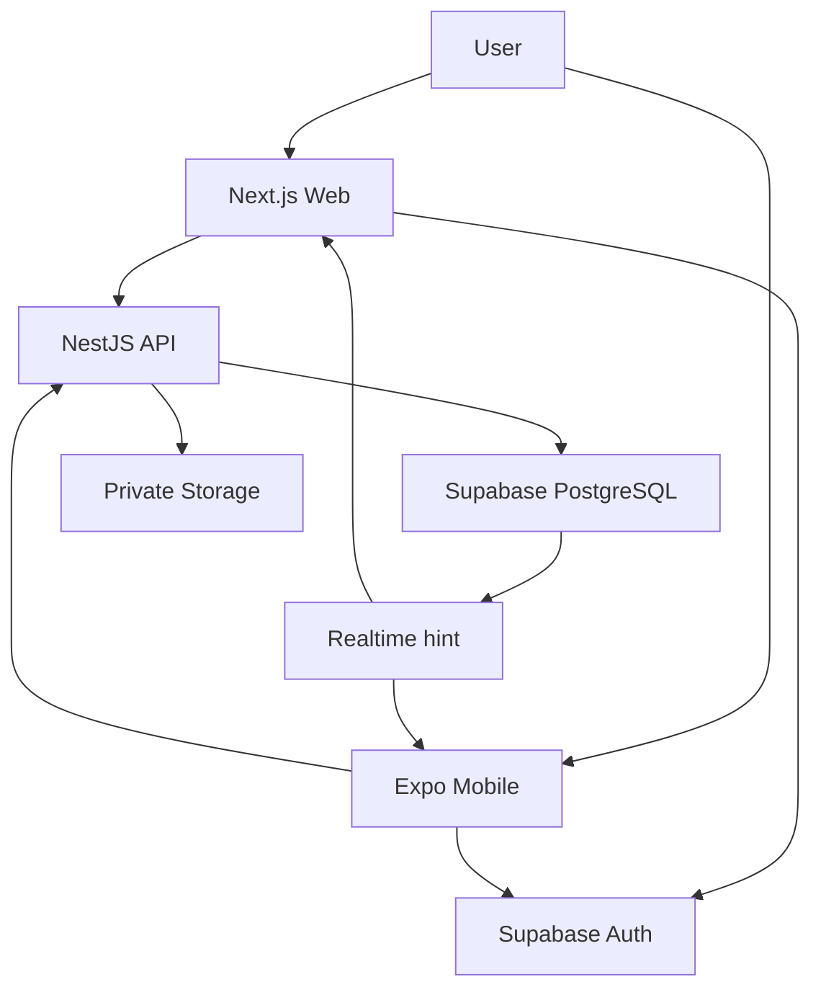
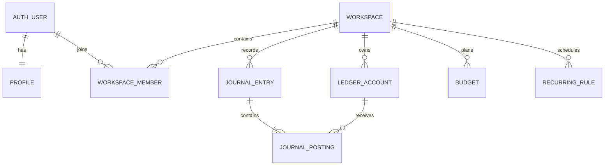

# NoorixFin — Production System Blueprint

**Document version:** 1.0  
**Research cutoff:** 1 August 2026  
**Document type:** Product, UX, architecture, database, security, delivery and acceptance blueprint  
**Status:** Build-ready design; implemented বা tested system-এর প্রমাণ নয়

---

## 1. Fact-checking legend

এই নথিতে চার ধরনের statement ব্যবহার করা হয়েছে:

- **Verified fact:** official documentation বা live product source দিয়ে যাচাই করা তথ্য।
- **Architecture decision:** NoorixFin-এর জন্য এই blueprint-এ নির্বাচিত design।
- **Recommendation:** বাস্তবায়নের সময় অনুসরণযোগ্য engineering পরামর্শ।
- **Open decision:** owner/legal/product team-এর সিদ্ধান্ত ছাড়া final করা যাবে না।

### 1.1 Naming — collision resolved, clearance still open

**RESOLVED 2026-08-04 (DEC-008):** এই blueprint-এর original working name ছিল `MyFin`, যা বাজারে unique ছিল না — `MyFin` নামে একটি Bulgarian digital wallet, `MyFin Budget` নামে personal-finance product, এবং App Store/Google Play-এ আরও expense-tracker app বিদ্যমান। সেই collision এড়াতে product-টি **`NoorixFin`** নামে rename করা হয়েছে; পুরো monorepo, npm scope (`@noorixfin/*`), UI text এবং store identifier এখন এই নামে।

Original collision sources (historical record — এগুলো **অন্য** product, NoorixFin নয়): [MyFin digital wallet](https://www.myfin.bg/), [MyFin on Google Play](https://play.google.com/store/apps/details?id=bg.myfin.myfin), [MyFin Budget](https://myfinbudget.com/), [MyFin expense tracker on App Store](https://apps.apple.com/us/app/myfin-expense-tracker/id1616732749)

> **এখনও open:** rename দিয়ে known collision-টি সরানো হয়েছে, কিন্তু **trademark clearance হয়নি**। Public launch-এর আগে target country অনুযায়ী trademark lawyer দিয়ে clearance, domain check, social handle check এবং App Store/Google Play listing check করতে হবে। শুধু web search বা rename trademark ownership প্রমাণ বা অস্বীকার করে না। — Phase 6 owner action (DEC-008)।

---

## 2. Executive decision

### 2.1 Product definition

NoorixFin হবে একটি **non-custodial personal and household finance-management system**। ব্যবহারকারী Web ও Mobile—দুই জায়গায় একই account দিয়ে login করে একই canonical data দেখবে। এটি শুরুতে money transfer, banking, lending, investment execution বা financial advice দেবে না; ব্যবহারকারীর আয়, খরচ, বাজেট, সঞ্চয়, দেনা, recurring bill এবং financial calendar পরিচালনা করবে।

### 2.2 Target users

1. **Bachelor/individual:** salary, daily expense, bills, savings ও debt tracking।
2. **Student (initially 18+):** allowance/pocket money, tuition, daily/weekly spending limit ও savings goal।
3. **Family/couple:** আলাদা login, shared workspace, member roles, joint budget ও shared calendar।
4. **Employee/freelancer:** multiple income source, irregular income, recurring expenses ও cash-flow tracking।

> **Age decision:** MVP-কে 18+ করা সবচেয়ে নিরাপদ initial scope। Minor users নিতে চাইলে parental consent, child-privacy law, age assurance এবং store-policy review আলাদাভাবে করতে হবে।

### 2.3 Chosen technology stack

| Layer | Selected technology | Decision reason |
|---|---|---|
| Web | Next.js App Router + TypeScript | Fast server-rendered web UI, routing, accessibility ও mature React ecosystem |
| Mobile | React Native + Expo + TypeScript | Android/iOS-এর জন্য এক shared codebase; native build এবং device API support |
| Backend | NestJS modular monolith + REST/OpenAPI | Web/Mobile-এর জন্য এক business boundary; validation, authorization, audit ও jobs কেন্দ্রীভূত |
| Database | Supabase PostgreSQL | একই canonical relational database, transactions, constraints, RLS ও reporting |
| Identity | Supabase Auth | Web/Mobile session, email/password, magic link এবং selected OAuth providers |
| File storage | Supabase Storage, private buckets | Receipt/export file; RLS-backed access policies |
| Realtime | Supabase Realtime as an invalidation signal | অন্য device-এ change হলে cache refetch; database-ই source of truth |
| Local mobile cache | Expo SQLite; sensitive cache হলে SQLCipher | Offline queue/cache across app restarts |
| Mobile secrets | Expo SecureStore | ছোট token/key-value securely store করা |
| i18n | i18next + react-i18next + Expo Localization | বাংলা/English এবং future language; plural/context/format support |
| Client data | TanStack Query | Server-state cache, retries, invalidation ও optimistic UX |
| Repository | pnpm workspace + Turborepo | Web, Mobile, API ও shared packages একটি TypeScript monorepo-তে |
| API contract | OpenAPI-generated clients | Web/Mobile API contract drift কমানো |
| Deployment | Dockerized NestJS API + managed web host + Supabase | Provider বদলানো সহজ; microservice complexity ছাড়া scalable start |

Supabase প্রতি project-এ full PostgreSQL database দেয়; Auth, Storage এবং Realtime একই platform-এর অংশ। Expo-এর SQLite restart-এর পরও local database persist করে, আর SecureStore ছোট encrypted key-value রাখার জন্য তৈরি। Sources: [Supabase Database](https://supabase.com/docs/guides/database/overview), [Expo SQLite](https://docs.expo.dev/versions/latest/sdk/sqlite/), [Expo SecureStore](https://docs.expo.dev/versions/latest/sdk/securestore/)

### 2.4 Core architecture rule

**সব financial write NestJS API দিয়ে হবে।** Client সরাসরি financial table mutate করবে না। Supabase Auth client login/session দেবে; NestJS token যাচাই, permission check, domain validation ও audit করবে; PostgreSQL final transaction commit করবে। RLS থাকবে defence-in-depth হিসেবে।

---

## 3. Product goals and non-goals

### 3.1 Goals

- একই user identity ও canonical database থেকে Web/Mobile-এ consistent data।
- income, expense, transfer, budget, goal, debt এবং bill calendar এক system-এ।
- personal ও family workspace—দুই model একই architecture-এ।
- বাংলা ও English প্রথম release-এ; পরে code change ছাড়াই নতুন locale যোগ করা।
- exact financial arithmetic, duplicate-resistant writes এবং auditable correction history।
- weak network-এ usable mobile experience।
- privacy-first design; financial content analytics/log-এ leak না করা।
- staged growth: manual tracking আগে, bank integration/AI পরে।

### 3.2 Explicit non-goals for MVP

- Bank password, card PIN, CVV বা online-banking credential সংরক্ষণ।
- User funds hold, transfer বা payment execute করা।
- Loan approve, investment trade বা regulated financial advice দেওয়া।
- Unreviewed AI দিয়ে transaction delete/modify বা money-related decision নেওয়া।
- Full accounting/ERP, payroll বা business taxation system।
- Minor users, enterprise SSO বা country-specific tax filing।
- Scraping bank websites।

এই সীমা অতিক্রম করলে legal, licensing, security এবং operational scope materially বদলে যাবে।

---

## 4. Research-backed product direction

Current personal-finance products থেকে তিনটি useful pattern দেখা যায়:

1. **Plan, শুধু track নয়:** Goodbudget category/envelope-ভিত্তিক spending allocation ব্যবহার করে। NoorixFin-এ budget setup ও remaining-to-spend প্রথম-class feature হবে।
2. **Cross-device and shared access:** YNAB Web/Mobile sync এবং separate-login family sharing দেয়; NoorixFin-এ shared password নয়, প্রত্যেক member-এর নিজস্ব identity থাকবে।
3. **Goals + collaboration:** Monarch accounts, goals ও partner/professional collaboration এক view-তে আনে; NoorixFin family workspace-এ role-scoped collaboration রাখবে।

Sources: [Goodbudget envelope model](https://goodbudget.com/what-you-get/), [YNAB features](https://www.ynab.com/features), [Monarch collaboration](https://www.monarchmoney.com/for-employers)

### 4.1 NoorixFin differentiation

- Bangla-first, English-complete এবং Arabic/RTL-ready foundation।
- Student, bachelor ও family—persona templates; কিন্তু underlying data model এক।
- Manual-first workflow, যাতে unsupported bank region-এও product fully useful থাকে।
- Transparent calculations: প্রতিটি dashboard number drill-down করে source transactions দেখাবে।
- Privacy-safe family roles এবং amount-hiding mode।
- Simple UI-এর নিচে balanced journal model, যাতে balance drift কমে।

---

## 5. Information architecture and UX

### 5.1 Primary navigation

**Mobile bottom navigation**

1. Home
2. Transactions
3. Add (`+` central action)
4. Budget
5. More

**Web sidebar**

1. Dashboard
2. Transactions
3. Accounts
4. Budgets
5. Calendar & Bills
6. Goals & Debts
7. Reports
8. Family/Workspace
9. Settings

### 5.2 Onboarding flow

1. Language নির্বাচন: বাংলা / English।
2. Account creation বা sign-in।
3. Country, timezone, first day of week ও base currency নির্বাচন।
4. Persona নির্বাচন: Individual / Student / Family / Freelancer।
5. Personal workspace automatic create।
6. Optional family workspace create/invite।
7. Initial account add: Cash, Bank, Mobile Wallet, Card বা Loan।
8. Opening balance enter।
9. Suggested categories এবং starter budget template review।
10. First transaction add; dashboard populated।

### 5.3 Dashboard contract

Dashboard-এ defaultভাবে থাকবে:

- Current available balance (selected accounts)
- This month income, expense ও net cash flow
- Budget used/remaining progress
- Upcoming bills, overdue items এবং expected income
- Savings-goal progress
- Debt summary
- Recent transactions
- Category spending chart
- Workspace switcher
- “Amounts hide” privacy toggle

কোনো metric শুধু aggregate number দেখাবে না; click/tap করলে included accounts, period, filters এবং source transactions দেখা যাবে।

### 5.4 Quick-add transaction flow

Required fields কম রাখতে হবে:

- Type: Expense / Income / Transfer
- Amount
- Account
- Category (transfer হলে destination account)
- Date/time

Optional:

- Merchant/payee
- Note
- Tags
- Split categories
- Receipt
- Recurring rule
- Goal/debt link

### 5.5 Accessibility

- Target: **WCAG 2.2 AA** for Web এবং equivalent mobile accessibility practices।
- Color alone দিয়ে income/expense/status বোঝানো যাবে না।
- Minimum touch target, keyboard navigation, visible focus, screen-reader labels।
- Bangla text truncation, 200% text zoom এবং dynamic type test।
- Charts-এর সঙ্গে text/table alternative।
- Reduced motion support।

WCAG 2.2 web content-কে বিভিন্ন disability-এর জন্য accessible করার testable criteria দেয়। Source: [W3C WCAG 2.2](https://www.w3.org/TR/WCAG22/)

---

## 6. Functional scope by release

### 6.1 MVP — private beta

**Identity and settings**

- Email/password এবং email verification
- Password reset; optional magic link
- বাংলা/English
- Currency, locale, timezone ও week-start preference
- Session/device list এবং sign-out-all-devices
- In-app account deletion request

**Money management**

- Personal workspace
- Basic family workspace with Owner/Editor/Viewer
- Manual accounts: cash, bank, mobile wallet, credit card, loan
- Income, expense, transfer, adjustment এবং split transaction
- Categories, tags, note ও search/filter
- Monthly/weekly category budget
- Recurring income/expense rule
- Bill calendar and in-app reminders
- Basic savings goal and debt tracking
- Dashboard and core reports
- CSV export
- Same-data Web/Mobile sync
- Read cache and offline draft; full offline mutation sync নয়

### 6.2 Version 1 — public production

- Google and Apple sign-in, subject to store configuration
- Family Admin role, invitations, member activity audit
- Receipt upload with private access and malware-scanning pipeline
- Push/email notification preferences and quiet hours
- Budget rollover and envelope/group budget modes
- Goal contribution and debt repayment planner
- PDF report export
- Import preview + CSV mapping + duplicate detection
- Full account/data export and verified deletion workflow
- Admin/support console with metadata-only default view
- Backup/restore evidence, monitoring, rate limiting and production security gate

### 6.3 Version 2 — advanced planning

- Encrypted mobile offline queue and deterministic delta sync
- Multi-currency transfers, locked FX rate and base-currency reports
- Transaction rules and suggested categorization
- Shared goals and approval option for selected family expenses
- Widgets, receipt OCR with human confirmation
- Forecasted cash flow and “safe to spend” calculation
- Advanced reports, net-worth history, custom dashboards
- Arabic/RTL and additional locale packs

### 6.4 Version 3 — regulated integrations, only after separate approval

- Official open-banking/data-aggregator integration by supported region
- Automated bank transaction import and reconciliation
- AI insights with explainable source links and explicit opt-in
- Subscription billing and premium family plan
- Advisor/view-only access with expiry and revocation
- Regional tax export adapters

**Gate:** Version 3-এর bank/AI features MVP code path-এ hidden placeholder হিসেবে রাখা হবে না। Legal basis, provider contract, consent model, threat model এবং deletion policy approved হওয়ার পর আলাদা integration হিসেবে build হবে।

---

## 7. System architecture



### 7.1 Modular monolith, not microservices

NestJS backend শুরুতে একটি deployable application হবে, কিন্তু domain module আলাদা থাকবে:

- `auth`
- `profiles`
- `workspaces`
- `memberships`
- `accounts`
- `ledger`
- `categories`
- `budgets`
- `recurring`
- `calendar`
- `goals`
- `debts`
- `reports`
- `attachments`
- `imports-exports`
- `notifications`
- `sync`
- `audit`
- `admin`

এতে transaction boundary সহজ থাকে এবং premature distributed-system failure এড়ানো যায়। ভবিষ্যতে notification/report worker আলাদা process করা যাবে, API contract না বদলে।

### 7.2 Authentication flow

1. Web/Mobile Supabase Auth দিয়ে sign in করে।
2. Client Supabase access token পায়।
3. Client HTTPS-এ `Authorization: Bearer <token>` দিয়ে NestJS API call করে।
4. API Supabase JWKS দিয়ে signature এবং `iss`, `aud`, `exp`, `sub` claims validate করে।
5. API request-এর workspace membership ও operation-specific permission verify করে।
6. API validated command database transaction-এ execute করে।
7. Audit event এবং outbox event একই transaction-এ write হয়।
8. Response-এর পরে notification/realtime worker async side effects সম্পন্ন করে।

Supabase JWT identity/authorization information বহন করে এবং RLS-এর ভিত্তি হিসেবে ব্যবহৃত হয়। Source: [Supabase JWT documentation](https://supabase.com/docs/guides/auth/jwts)

### 7.3 Database-access rule

- Regular request-এ NestJS request-scoped Supabase client তৈরি করবে: publishable key + caller-এর Bearer token। এতে database call caller-এর RLS context-এ চলবে।
- Multi-table atomic command vetted PostgreSQL function/RPC-তে হবে; default `SECURITY INVOKER`, যাতে caller permission/RLS বজায় থাকে। Exception দরকার হলে আলাদা security review ছাড়া `SECURITY DEFINER` ব্যবহার করা যাবে না।
- Regular user request-এ API user-context ব্যবহার করবে এবং RLS-compatible operation/RPC call করবে।
- `service_role` browser/mobile bundle, public environment variable, logs বা analytics-এ কখনও যাবে না।
- Supabase service key RLS bypass করতে পারে; তাই background/admin কাজের জন্য আলাদা restricted internal client ছাড়া এটি ব্যবহার করা যাবে না।
- Every admin operation-এর explicit authorization, reason এবং audit record লাগবে।

Source: [Supabase RLS and bypass warning](https://supabase.com/docs/guides/database/postgres/row-level-security)

### 7.4 Realtime rule

Realtime event canonical data নয়; এটি client-কে সংশ্লিষ্ট query refetch করার hint দেবে। Financial state database response থেকে পুনরায় load হবে। Subscription filter workspace/user scope-এ সীমাবদ্ধ থাকবে। Supabase Postgres Changes প্রত্যেক subscriber-এর জন্য authorization check করে এবং large concurrent subscription-এ scaling limitation আছে; scale test ছাড়া এটিকে universal event bus করা যাবে না। Source: [Supabase Postgres Changes](https://supabase.com/docs/guides/realtime/postgres-changes)

### 7.5 Monorepo layout

```text
noorixfin/
├── apps/
│   ├── web/                 # Next.js
│   ├── mobile/              # Expo React Native
│   └── api/                 # NestJS
├── packages/
│   ├── api-client/          # OpenAPI-generated clients
│   ├── domain/              # Pure shared domain types/rules
│   ├── design-tokens/       # Colors, spacing, typography
│   ├── i18n/                # bn/en catalogs
│   ├── money/               # Minor-unit and currency utilities
│   └── test-fixtures/
├── supabase/
│   ├── migrations/
│   ├── seed.sql
│   └── tests/               # pgTAP/RLS tests
├── infra/
│   ├── docker/
│   └── deployment/
└── docs/
```

Web এবং Mobile UI component সরাসরি share করার চেষ্টা না করে design tokens, API client, validation-independent domain types এবং translations share করবে। Native ও Web interaction আলাদা হওয়ায় forced universal component সাধারণত maintenance বাড়ায়।

---

## 8. Financial correctness model

### 8.1 Money representation

- JavaScript floating-point দিয়ে money arithmetic করা যাবে না।
- Stored amount হবে **minor-unit integer** (`bigint`), যেমন SAR 10.25 = `1025` halala।
- API-তে bigint amount decimal string হিসেবে পাঠানো হবে, যেমন `"1025"`; JSON number নয়।
- Currency হবে ISO-style three-letter code (`SAR`, `BDT`, `USD`) এবং separate currency metadata-তে decimal exponent থাকবে।
- Exchange rate exact `numeric` type-এ থাকবে; binary float নয়।
- Display formatting client locale অনুযায়ী `Intl.NumberFormat` দিয়ে হবে; stored amount locale-formatted string হবে না।

PostgreSQL `bigint` fixed-range integer এবং `numeric/decimal` exact arbitrary-precision decimal support করে। Source: [PostgreSQL numeric types](https://www.postgresql.org/docs/current/datatype-numeric.html)

### 8.2 Balanced journal

User simple income/expense form দেখবে, কিন্তু backend balanced journal entry তৈরি করবে:

- Expense: Asset account credit + Expense category debit
- Income: Income category credit + Asset account debit
- Transfer: Source account credit + Destination account debit
- Opening balance: Asset/Liability account + Opening-balance equity

প্রতিটি finalized journal entry-তে:

- minimum দুইটি posting থাকবে;
- total debit = total credit হবে;
- same workspace হবে;
- currency/base-currency rules pass করবে;
- finalized entry in-place edit হবে না;
- correction হলে reversal entry + replacement entry তৈরি হবে।

এটি recommendation/architecture decision; personal-finance UI-তে accounting terminology দেখানোর দরকার নেই।

### 8.3 Idempotency and concurrency

- প্রত্যেক create command-এ client-generated UUID এবং `Idempotency-Key` থাকবে।
- Same user + same endpoint + same key আবার এলে duplicate transaction নয়, previous result ফিরবে।
- Editable aggregate-এ integer `version` থাকবে।
- Update-এ expected version লাগবে; mismatch হলে `409 Conflict` এবং latest server state।
- Financial correction-এ blind last-write-wins নিষিদ্ধ।

---

## 9. Canonical data model

### 9.1 Tenancy model

সব financial data একটি `workspace_id` দ্বারা scoped হবে।

- `PERSONAL` workspace: owner এক user; future support access explicit না হলে অন্য কেউ নয়।
- `FAMILY` workspace: multiple members এবং roles।
- একজন user একাধিক workspace-এর member হতে পারে।
- ব্যক্তিগত ও family transactions মিশবে না; explicit transfer/import ছাড়া cross-workspace reference নিষিদ্ধ।



### 9.2 Identity and access tables

#### `profiles`

- `id uuid PK` → `auth.users.id`
- `display_name text`
- `avatar_path text nullable`
- `locale text` (`bn`, `en`, future `ar-SA`)
- `timezone text` (IANA name, e.g. `Asia/Riyadh`)
- `base_currency char(3)`
- `week_starts_on smallint`
- `amount_privacy_default boolean`
- `onboarding_status text`
- `created_at`, `updated_at timestamptz`

#### `workspaces`

- `id uuid PK`
- `type PERSONAL | FAMILY`
- `name text`
- `base_currency char(3)`
- `timezone text`
- `created_by uuid`
- `status ACTIVE | PENDING_DELETION | DELETED`
- timestamps

#### `workspace_members`

- `workspace_id uuid FK`
- `user_id uuid FK`
- `role OWNER | ADMIN | EDITOR | VIEWER`
- `status INVITED | ACTIVE | SUSPENDED | LEFT`
- `joined_at`, `updated_at`
- composite PK `(workspace_id, user_id)`

#### `workspace_invitations`

- email/phone raw token নয়; `token_hash`
- invited role, inviter, expiry, accepted/revoked timestamps
- one-time use এবং rate limit

### 9.3 Ledger tables

#### `ledger_accounts`

- `id`, `workspace_id`
- `name`
- `class ASSET | LIABILITY | INCOME | EXPENSE | EQUITY`
- `subtype CASH | BANK | MOBILE_WALLET | CREDIT_CARD | LOAN | SAVINGS | CATEGORY | SYSTEM`
- `currency_code`
- `normal_balance DEBIT | CREDIT`
- `include_in_budget`, `include_in_net_worth`
- `opening_date`
- `archived_at nullable`
- `created_by`, timestamps, `version`

#### `categories`

- `id`, `workspace_id nullable` (system category হলে null)
- `ledger_account_id`
- `kind INCOME | EXPENSE`
- `parent_id nullable`
- `translation_key nullable` for system categories
- `custom_name nullable`
- `icon`, `color`, `sort_order`
- `archived_at`

#### `journal_entries`

- `id`, `workspace_id`
- `entry_type INCOME | EXPENSE | TRANSFER | ADJUSTMENT | OPENING | REVERSAL`
- `occurred_at timestamptz`
- `local_date date`
- `payee`, `note`
- `status DRAFT | PENDING | POSTED | VOIDED`
- `source MANUAL | IMPORT | RECURRING | SYSTEM`
- `client_entry_id uuid`
- `idempotency_key_hash`
- `reverses_entry_id nullable`
- `created_by`, `posted_at`, timestamps
- `version`

#### `journal_postings`

- `id`, `journal_entry_id`, `ledger_account_id`
- `debit_minor bigint default 0`
- `credit_minor bigint default 0`
- `currency_code`
- `base_amount_minor bigint`
- `fx_rate numeric nullable`
- `memo nullable`

Database constraint: একই row-তে debit ও credit একসঙ্গে positive হতে পারবে না; zero-only posting নিষিদ্ধ; entry-level deferred validation total balance নিশ্চিত করবে।

### 9.4 Planning tables

#### `budgets` and `budget_lines`

- workspace, name, cadence, start/end date, rollover policy, status
- category/account, planned minor amount, carry-in/out, alert threshold
- unique line per category + period unless group budget explicitly enabled

#### `savings_goals`

- workspace, name, target amount/currency/date
- linked account(s), status, priority
- contribution calculation source-driven; arbitrary editable “progress” নয়

#### `debt_details`

- linked liability account
- principal/opening balance, annual rate, minimum payment, due day
- rate optional; calculator result স্পষ্টভাবে estimate হিসেবে label হবে

#### `recurring_rules`

- template entry reference/data
- recurrence rule, timezone, next occurrence
- behavior: `REMIND_ONLY` or `AUTO_CREATE_DRAFT`
- MVP-তে unconfirmed external expense auto-post নয়

#### `calendar_events`

- type BILL | INCOME | GOAL | CUSTOM
- due datetime/timezone, recurrence, reminder offsets
- linked recurring rule/journal entry optional
- status UPCOMING | DUE | PAID | SKIPPED | OVERDUE

### 9.5 Supporting tables

- `tags`, `journal_entry_tags`
- `attachments` — private storage path, checksum, MIME, scan status
- `exchange_rate_snapshots` — source, timestamp, pair, exact rate
- `notification_preferences`, `notifications`, `device_tokens`
- `import_jobs`, `import_rows`, `import_mappings`
- `export_jobs`
- `idempotency_records`
- `outbox_events`
- `audit_events`
- `data_deletion_requests`
- `feature_flags`

### 9.6 Database-wide rules

- All timestamps UTC `timestamptz`; user timezone separately stored।
- Financial tenant tables-এ `workspace_id NOT NULL`।
- Foreign key behavior deliberate: ledger rows accidental cascade delete নয়।
- Posted finance records hard-delete নয়; reversal/retention workflow।
- User-visible deletion এবং legal/backup retention policy আলাদা documented হবে।
- Unique/index:
  - `workspace_members(user_id, workspace_id)`
  - all major lists `(workspace_id, occurred_at desc, id)`
  - RLS predicate columns indexed
  - active recurring `(workspace_id, next_occurrence) WHERE status='ACTIVE'`
  - idempotency unique `(actor_user_id, route, key_hash)`

---

## 10. Authorization and RLS

### 10.1 Role matrix

| Action | Owner | Admin | Editor | Viewer |
|---|---:|---:|---:|---:|
| View workspace finance data | Yes | Yes | Yes | Yes |
| Create/edit draft transaction | Yes | Yes | Yes | No |
| Post/reverse transaction | Yes | Yes | Yes | No |
| Manage budget/categories/calendar | Yes | Yes | Yes | No |
| Invite/remove Viewer/Editor | Yes | Yes | No | No |
| Promote Admin/transfer ownership | Yes | No | No | No |
| Export full workspace | Yes | Configurable | No | No |
| Delete workspace | Yes | No | No | No |
| View security/audit settings | Yes | Limited | No | No |

### 10.2 RLS policy concept

Every workspace table policy must require an active membership:

```sql
exists (
  select 1
  from workspace_members wm
  where wm.workspace_id = target.workspace_id
    and wm.user_id = auth.uid()
    and wm.status = 'ACTIVE'
)
```

Write policy-তে required role-ও check হবে। `workspace_members` predicate columns indexed থাকবে। RLS enable করা এবং policy create করা দুইটি আলাদা কাজ; exposed table-এ RLS policy test ছাড়া deployment block হবে। Supabase exposed tables-এ RLS ব্যবহারের নির্দেশ দেয় এবং policy columns index করার performance benefit দেখায়। Source: [Supabase RLS](https://supabase.com/docs/guides/database/postgres/row-level-security)

### 10.3 Admin access

- Admin console defaultভাবে aggregate operational metadata দেখবে, merchant/note/amount নয়।
- Support impersonation default disabled।
- Break-glass access দরকার হলে: strong MFA, user/owner consent বা documented emergency basis, expiry, reason, immutable audit এবং review।
- Database dashboard access production support role-এর everyday tool হবে না।

---

## 11. API contract

### 11.1 API style

- Base path: `/v1`
- REST JSON; OpenAPI generated spec
- Cursor pagination; offset নয় large transaction history-তে
- Standard error body: code, message, field errors, request ID
- Every request traceable by `X-Request-ID`
- Every mutation accepts `Idempotency-Key`
- Update accepts expected `version`/`If-Match`
- API dates ISO 8601; amount minor-unit decimal strings

NestJS official modules OpenAPI document generate করতে পারে; global `ValidationPipe` incoming DTO rule enforce করতে সাহায্য করে। Sources: [NestJS OpenAPI](https://docs.nestjs.com/openapi/introduction), [NestJS validation](https://docs.nestjs.com/techniques/validation)

### 11.2 Core endpoints

```text
GET    /v1/me
PATCH  /v1/me/preferences
GET    /v1/workspaces
POST   /v1/workspaces
POST   /v1/workspaces/:id/invitations
PATCH  /v1/workspaces/:id/members/:userId

GET    /v1/workspaces/:id/accounts
POST   /v1/workspaces/:id/accounts
PATCH  /v1/accounts/:id

GET    /v1/workspaces/:id/transactions
POST   /v1/workspaces/:id/transactions
GET    /v1/transactions/:id
POST   /v1/transactions/:id/reverse

GET    /v1/workspaces/:id/budgets
POST   /v1/workspaces/:id/budgets
GET    /v1/workspaces/:id/calendar
POST   /v1/workspaces/:id/recurring-rules
GET    /v1/workspaces/:id/goals
GET    /v1/workspaces/:id/reports/cash-flow
GET    /v1/workspaces/:id/reports/net-worth

POST   /v1/attachments/upload-intent
POST   /v1/imports
POST   /v1/exports
GET    /v1/sync/changes?cursor=...
POST   /v1/account/deletion-request
```

### 11.3 Reporting rules

- Report response-এ period, timezone, currency basis, excluded accounts এবং generated-at থাকবে।
- Aggregate number drill-down filter link দেবে।
- Heavy report async job/materialized summary হতে পারে; source ledger authoritative থাকবে।
- Cached report key-এর অংশ: workspace, role scope, filters, currency, timezone, ledger revision।

---

## 12. Cross-device and offline synchronization

### 12.1 Source of truth

Supabase PostgreSQL একমাত্র canonical source। Web cache, mobile SQLite এবং Realtime event derived copies/hints।

### 12.2 MVP sync

- Online mutation → API → database commit → response → local cache update।
- Realtime hint → relevant query invalidation → API refetch।
- Offline অবস্থায় existing cached data read করা যাবে।
- New transaction offline-এ **draft** হিসেবে save হবে; online হলে user review করে submit করবে।
- Full automatic offline replay Version 2 পর্যন্ত postponed, কারণ duplicate/conflict/error recovery finance data-তে critical।

### 12.3 Version 2 deterministic sync

1. Client mutation UUID, device ID, base version এবং idempotency key তৈরি করে।
2. Encrypted local queue ordered by workspace রাখে।
3. Connectivity ফিরলে one-at-a-time submit করে।
4. Server success, validation error বা conflict স্পষ্ট state ফিরায়।
5. Success হলে local draft canonical server ID/revision নেয়।
6. Conflict হলে amount/account/category silently overwrite নয়; user diff review করে।
7. Delta endpoint monotonic change cursor দেয়; cursor invalid হলে safe full resync।

### 12.4 Local security

- Mobile session token SecureStore-এ। Full transaction history SecureStore-এ নয়।
- Sensitive SQLite cache দরকার হলে SQLCipher-enabled development/release build; Expo Go SQLCipher support করে না। Source: [Expo SQLite SQLCipher](https://docs.expo.dev/versions/latest/sdk/sqlite/)
- Biometric feature local app unlock; server authentication বা MFA-এর replacement নয়। Expo LocalAuthentication Face ID/Touch ID/biometric prompt access দেয়। Source: [Expo LocalAuthentication](https://docs.expo.dev/versions/latest/sdk/local-authentication/)
- Web-এ untrusted shared device default ধরে persistent financial cache সীমিত রাখা হবে।

---

## 13. Internationalization

### 13.1 Initial languages

- `bn` — primary Bangla experience
- `en` — complete fallback
- future: `ar`, `hi`, `ur` ইত্যাদি

### 13.2 Translation architecture

```text
packages/i18n/locales/
├── bn/
│   ├── common.json
│   ├── transactions.json
│   ├── budgets.json
│   ├── calendar.json
│   └── errors.json
└── en/
    └── ...same namespaces
```

Rules:

- UI sentence database-এ নয়; locale catalog-এ।
- Translation key stable হবে; English text key হিসেবে ব্যবহার নয়।
- Interpolation, plural/context এবং number/date formatting library দিয়ে।
- Currency name ও amount browser/device `Intl` data দিয়ে।
- User-created category/name translate হবে না; system category `translation_key` ব্যবহার করবে।
- Server error machine `code` পাঠাবে; client localized message দেখাবে।
- Email/push template recipient locale অনুযায়ী render হবে।
- Missing key CI failure; fallback English।

Expo Localization device locale data দেয় এবং react-i18next-এর মতো localization library ব্যবহারের কথা বলে; i18next plural, context, interpolation ও formatting support করে। Sources: [Expo Localization](https://docs.expo.dev/versions/latest/sdk/localization/), [i18next](https://www.i18next.com/)

### 13.3 RTL readiness

- CSS physical `left/right` নয়; logical `inline-start/end`।
- Icons with direction semantics mirror হবে; currency/phone/email নয়।
- Charts, table alignment, date picker এবং mixed Arabic/Latin amount test।
- Arabic add করার আগেই snapshot/E2E RTL test suite চালু।

---

## 14. Notifications and calendar

### 14.1 Channels

- In-app notification
- Mobile push
- Email (selected events)
- Local device reminder, only when safe and user-enabled

Expo Notifications push token পাওয়া এবং notifications receive/respond করার API দেয়। Source: [Expo Notifications](https://docs.expo.dev/versions/latest/sdk/notifications/)

### 14.2 Privacy defaults

- Lock-screen push-এ amount, account name বা merchant defaultভাবে দেখানো হবে না।
- Default text: “NoorixFin-এ একটি bill reminder আছে।”
- User explicit setting দিয়ে details enable করতে পারবে।
- Quiet hours, timezone, per-event preference এবং one-click unsubscribe যেখানে প্রযোজ্য।

### 14.3 Reliable delivery

- Domain transaction এবং `outbox_events` একই database transaction-এ commit।
- Worker pending event lease নিয়ে send করে।
- Provider timeout/retry idempotent।
- Permanent failure dead-letter state-এ এবং operational alert।
- Supabase Cron recurring job schedule ও run history রাখতে পারে; official guidance একসঙ্গে 8টির বেশি job না চালানো এবং job 10 মিনিটের মধ্যে রাখার recommendation দেয়। Source: [Supabase Cron](https://supabase.com/docs/guides/cron)

---

## 15. Attachments, imports and exports

### 15.1 Receipt storage

- Private bucket only; public URL নয়।
- Path: `workspace_id/user_id/object_uuid` — original filename authorization key নয়।
- Allowed MIME/extension allowlist, maximum size, checksum।
- Server-side content inspection/malware scan status: `PENDING`, `CLEAN`, `REJECTED`।
- Scan complete হওয়ার আগে download/share blocked।
- Short-lived signed access or authenticated download endpoint।
- Image metadata strip where practical।

Supabase Storage upload defaultভাবে RLS policy ছাড়া allow করে না; service key access control bypass করতে পারে। Source: [Supabase Storage access control](https://supabase.com/docs/guides/storage/security/access-control)

### 15.2 CSV import

1. Upload to private temporary storage।
2. Detect delimiter/encoding; original preview।
3. User maps date, amount, type, account, category, note।
4. Parse locale-aware but store canonical values।
5. Duplicate candidates hash/date/amount/account/payee দিয়ে flag; automatic delete নয়।
6. User confirms rows।
7. Batch creates balanced entries with per-row result।
8. Import can be reversed as a group।

### 15.3 Export

- CSV: transactions, accounts, budgets, categories, goals।
- JSON: complete machine-readable account export।
- PDF: human-readable report; source data export-এর replacement নয়।
- Export file expiry ও secure re-authentication।
- Audit: who, workspace, scope, time, status; exported financial contents logs-এ নয়।

---

## 16. Security and privacy blueprint

### 16.1 Threat model

Critical threats:

- Account takeover
- Broken object-level authorization / cross-workspace data exposure
- RLS policy omission or bypass
- Service-role secret leakage
- Duplicate/replayed financial mutations
- Malicious receipt/import file
- Stolen unlocked phone বা insecure local cache
- Family role abuse
- Sensitive data in logs, analytics, crash reports or notifications
- Supply-chain compromise
- Backup failure or untested restore

### 16.2 Required controls

**Identity**

- Verified email; strong password policy; breached-password protection where available
- MFA option; owner/admin sensitive actions-এ step-up authentication
- Refresh/session revocation এবং suspicious-login notification
- OAuth redirect allowlist; mobile deep-link validation
- Rate limit, CAPTCHA/bot control on abuse-prone auth flows

**Authorization**

- Default deny guards in API
- Every resource lookup includes authorized `workspace_id`
- RLS on every exposed tenant table
- Negative cross-user/cross-role tests
- Fresh membership check for export, invite, role change and delete

**Application/API**

- Schema validation and unknown-field rejection
- Exact CORS origins
- CSRF protection for cookie-authenticated Web endpoints
- Content Security Policy, clickjacking/referrer/security headers
- Per-user/IP/action rate limits; NestJS provides official throttler integration. Source: [NestJS rate limiting](https://docs.nestjs.com/security/rate-limiting)
- Secrets only deployment secret manager/server environment
- Dependency lockfile, automated vulnerability scan, signed releases where practical

**Data**

- TLS in transit
- Private storage and short-lived access
- No PIN/CVV/bank credential
- Financial contents redacted from logs and analytics
- Database backup + storage-object backup separately
- Encryption key rotation plan; local mobile cache protection

**Web**

- Strict CSP; Next.js notes CSP helps mitigate XSS, clickjacking and code-injection threats. Source: [Next.js CSP guide](https://nextjs.org/docs/app/guides/content-security-policy)
- No tokens in URL, localStorage or client logs
- Server-set `HttpOnly`, `Secure`, appropriate `SameSite` cookies when cookie session used

**Mobile**

- SecureStore for session secrets
- Biometric local lock optional
- Root/jailbreak signal can warn and tighten behavior, but must not be treated as foolproof
- Screenshot/app-switcher masking on sensitive screens where platform permits
- Deep-link allowlist and universal/app links
- Release build must not include debug endpoints or source secrets

### 16.3 Security verification baseline

- Web/API: OWASP ASVS control set tailored to NoorixFin risk
- Mobile: OWASP MASVS/MASTG checklist
- Threat model updated for every major feature
- Independent penetration test before public production and after material auth/payment/bank change

OWASP ASVS web security-control testing requirements দেয়; MASVS mobile application security verification standard। Sources: [OWASP ASVS](https://owasp.org/www-project-application-security-verification-standard/), [OWASP MASVS](https://mas.owasp.org/MASVS/)

### 16.4 Privacy model

- Data inventory: identity, financial records, device tokens, receipts, support/audit metadata।
- Data minimization: analytics-এ amount, merchant, note, account balance, receipt নয়।
- Privacy policy data type, purpose, retention, processor এবং deletion ব্যাখ্যা করবে।
- Consent version/time recorded where consent is required।
- In-app data export and account deletion।
- Deletion workflow আগে user-owned workspace transfer/other members impact explain করবে।
- Backups থেকে expiry natural retention schedule অনুযায়ী; “instant delete from every backup” claim করা যাবে না যদি technically সত্য না হয়।
- Region/country launch-এর আগে qualified legal review; blueprint legal advice নয়।

Apple account-creating app-এ in-app deletion initiation চায়; Google Play-এ account deletion এবং Data Safety declaration requirements আছে। Google Play সব published app-এর জন্য Financial features declaration-ও চায়। Sources: [Apple account deletion](https://developer.apple.com/support/offering-account-deletion-in-your-app/), [Google Play account deletion](https://support.google.com/googleplay/android-developer/answer/13327111), [Google Play Data Safety](https://support.google.com/googleplay/android-developer/answer/10787469), [Google Play Financial features declaration](https://support.google.com/googleplay/android-developer/answer/13849271)

---

## 17. Supabase Free-plan reality

**Verified as of 1 August 2026:** Supabase public pricing currently lists Free plan-এর জন্য 50,000 MAU, 500 MB database, shared CPU/500 MB RAM, 5 GB egress, 5 GB cached egress এবং 1 GB file storage। Free project এক সপ্তাহ inactivity-এর পরে pause হতে পারে এবং দুইটি active free project-এর limit আছে। Pricing can change; build/release-এর সময় পুনরায় verify করতে হবে। Source: [Supabase pricing](https://supabase.com/pricing)

### 17.1 What Free is suitable for

- Local development-linked remote project
- Prototype
- Small private beta
- Schema/RLS/API validation

### 17.2 What Free is not sufficient to prove

- Production availability/SLA
- Safe three-environment setup (dev/staging/prod)
- Adequate receipt capacity
- Production backup/restore posture
- Real user load capacity

### 17.3 Required production upgrade gate

Public launch-এর আগে paid production project strongly recommended, কারণ official automatic daily backups Pro/Team/Enterprise projects-এর জন্য; Free project-এ regular CLI dump এবং off-site backup রাখতে Supabase নিজেই recommend করে। Storage objects database backup-এর অংশ নয়। Source: [Supabase Database Backups](https://supabase.com/docs/guides/platform/backups)

Minimum environment separation:

- Local Supabase for development
- Remote staging project
- Separate production project

Production data staging/dev-এ copy করা যাবে না; sanitized seed fixtures ব্যবহার হবে।

---

## 18. Reliability, backup and observability

### 18.1 Reliability targets

এগুলো **design targets**, current capability claim নয়:

- No accepted financial write lost after committed success response
- Same idempotency key never creates two entries
- Ledger imbalance count = 0
- Cross-user data leakage count = 0
- Crash-free mobile sessions target ≥ 99.5% during beta
- Simple API endpoint p95 target ≤ 500 ms under agreed beta load
- Sync success target ≥ 99.9% excluding user validation conflicts

Availability SLA Free plan-এ promise করা যাবে না। Production SLO paid infrastructure এবং measured load test-এর পরে final হবে।

### 18.2 Backup policy

- Daily logical database backup to independent encrypted storage during beta
- Production: managed daily backup; business RPO অনুযায়ী PITR decision
- Supabase Storage objects-এর separate inventory + backup process
- Backup encryption, access log, retention and deletion policy
- Monthly automated restore rehearsal to isolated environment
- Quarterly owner-observed disaster-recovery exercise
- Restore evidence: row counts, ledger checksum/invariants, sample attachments, auth/config checklist

### 18.3 Observability

- Structured logs: timestamp, request ID, actor pseudonymous ID, route, status, latency
- Never log access token, password, amount, merchant, note, receipt or full request body
- Metrics: API latency/error, DB connection use, queue lag, outbox failure, cron failure, Realtime reconnect, sync conflict
- Tracing across API → DB → worker using correlation ID
- Alerts with runbook and severity
- Audit events separate from debug logs; append-only access and longer retention

---

## 19. Performance and scaling

### 19.1 Database

- Cursor pagination and bounded date ranges
- RLS predicate and common filter indexes
- Avoid N+1 queries
- Precomputed monthly summaries only after source-ledger correctness tests
- Query plan review for top endpoints
- Connection pooler for serverless/ephemeral API instances
- Archive old audit/outbox data according to retention policy

### 19.2 Client

- Dashboard parallel bounded queries or one purpose-built summary endpoint
- Virtualized long transaction lists
- Image receipt thumbnails, not originals
- Query cache scoped by user + workspace; logout clears all private cache
- Mobile low-data mode
- Charts lazy loaded

### 19.3 Scale thresholds

Upgrade/re-architecture must be triggered by measured signals, not user-count guess:

- Database/Storage/egress quota approaching agreed threshold
- p95 latency or error budget breach
- Realtime authorization/throughput bottleneck
- Report query contention
- Worker queue lag beyond reminder SLA

---

## 20. Admin and operations console

### 20.1 Safe default functions

- User/account status lookup
- Auth/session problem diagnostics
- Subscription/plan status when monetization exists
- Job, import, export, notification and system health
- Feature flags and minimum app version
- Translation/catalog release status
- Security alerts and audit review
- Data deletion request status

### 20.2 Prohibited default behavior

- Admin homepage-এ user balances/transactions দেখানো
- Silent impersonation
- Direct edit of posted journal entries
- Service-role key display
- Production SQL editor as routine support workflow
- Audit event delete/edit

---

## 21. Testing strategy

### 21.1 Test layers

1. **Unit:** money arithmetic, recurrence, permission, formatting-independent domain rules।
2. **Property-based:** random valid postings-এ debit/credit invariant; retry duplicate না করা।
3. **Database:** constraints, functions, migrations, rollback/forward, RLS।
4. **API integration:** real PostgreSQL/Supabase local stack; mocked DB দিয়ে security proof নয়।
5. **Contract:** OpenAPI schema এবং generated Web/Mobile client compatibility।
6. **Web E2E:** auth, add transaction, budget, family role, export, delete।
7. **Mobile E2E:** auth/deep link, biometric lock, offline draft, reconnect, push navigation।
8. **Sync/chaos:** timeout before/after commit, duplicate replay, stale version, event loss/reorder।
9. **Security:** ASVS/MASVS-aligned negative tests, dependency/secrets scan, pentest।
10. **Accessibility:** automated + keyboard/screen-reader/manual Bangla tests।
11. **Performance:** realistic tenant size, concurrent users, report load, Realtime subscriptions।
12. **Recovery:** backup restore and data-integrity verification।

### 21.2 Critical acceptance matrix

| ID | Requirement | Required proof | Pass rule |
|---|---|---|---|
| SEC-01 | User A cannot access User B personal workspace | API + direct Data API/RLS negative tests | Every read/write/export path denied |
| SEC-02 | Viewer cannot mutate | All mutation endpoints + DB policy tests | 100% denied, audit where appropriate |
| SEC-03 | Service key absent from clients | Built bundle/secret scan | Zero occurrences |
| FIN-01 | Every posted journal balanced | DB constraint/property test + invariant query | Zero imbalanced entries |
| FIN-02 | Retry cannot duplicate | Timeout before/after commit test | One canonical entry only |
| FIN-03 | Correction preserves history | Reverse/replace integration test | Original unchanged; linked reversal exists |
| SYNC-01 | Web and Mobile show same committed data | Cross-device E2E | Same canonical revision/amount |
| SYNC-02 | Stale edit detected | Two-device concurrency test | 409/conflict UI; no silent overwrite |
| I18N-01 | Bangla and English complete | Missing-key CI + main-flow screenshots | Zero missing key; layout usable |
| TIME-01 | Timezone boundary correct | DST/non-DST and month-boundary tests | Report/calendar uses workspace rule |
| DATA-01 | Export complete and scoped | Fixture reconciliation | Expected records/checksum; no other tenant |
| DATA-02 | Deletion flow works | End-to-end lifecycle + retention evidence | Access removed and policy followed |
| BACKUP-01 | Restore is usable | Isolated restore exercise | Ledger, memberships and files verified |
| STORE-01 | Store privacy declarations accurate | App behavior/SDK inventory review | No undeclared collection |
| A11Y-01 | Core flow accessible | WCAG 2.2 AA audit | No blocking A/AA defect |

**Rule:** exit code `0`, build success বা “test passed” message একা completion proof নয়। Test input, expected/prohibited outcome, logs/report, artifact এবং reviewer verdict সংরক্ষণ করতে হবে। Critical failure release block করবে।

---

## 22. CI/CD and environments

### 22.1 Pull-request gates

- Format/lint/typecheck
- Unit and property tests
- API contract diff
- Supabase migration reset from zero
- RLS policy tests
- Integration tests
- Secret/dependency/license scans
- Web production build
- Mobile build configuration validation
- i18n missing/unused key check
- Accessibility smoke tests

### 22.2 Database migration rules

- Every schema change versioned SQL migration।
- Remote production dashboard-এ manual schema edit নয়।
- Migration local reset + staging test + backup + deployment plan।
- Destructive change expand/migrate/contract pattern-এ।
- Rollback সবসময় possible নয়; forward-fix এবং restore plan লিখতে হবে।

Supabase official workflow migration files version করে এবং remote database direct edit এড়িয়ে migration history বজায় রাখতে বলে। Source: [Supabase database migrations](https://supabase.com/docs/guides/deployment/database-migrations)

### 22.3 Release flow

1. Feature branch + PR evidence
2. Preview/local tests
3. Merge to main
4. Staging migration and deploy
5. Staging E2E/security smoke
6. Owner release approval
7. Production backup/health check
8. Production migration
9. API/Web deploy
10. Mobile staged rollout
11. Post-deploy reconciliation and monitoring

---

## 23. Delivery plan — dependency order

### Phase 1 — Foundation

- Confirm working name vs final brand
- Product requirements and non-goals freeze
- Monorepo, CI, local Supabase, environments
- Auth flow and profile/preferences
- Workspace/membership model and RLS test harness
- Money/ledger contract and database migrations
- Bangla/English i18n foundation and design tokens

**Exit:** two users, two workspaces এবং all role isolation proven; empty app Web/Mobile একই identity দেখায়।

### Phase 2 — Core finance

- Accounts, categories, journal entries/postings
- Income/expense/transfer/split UI
- Idempotency, reversal, search, pagination
- Cross-device cache invalidation
- Dashboard basic summary

**Exit:** financial invariants, retry and Web/Mobile consistency evidence complete।

### Phase 3 — Planning

- Budgets, recurring rules, bills/calendar
- Goals and debts
- Reports and drill-down
- Notifications/outbox

**Exit:** monthly plan → transaction → budget/report/calendar lifecycle E2E pass।

### Phase 4 — Family, privacy and data portability

- Invitations and full role matrix
- Audit UX
- CSV import/export
- Account/workspace deletion
- Receipt pipeline

**Exit:** family negative tests, export reconciliation, deletion and attachment security pass।

### Phase 5 — Production hardening

- Paid production infrastructure decision
- Backup/restore rehearsal
- Load/performance tests
- ASVS/MASVS review and independent pentest
- Accessibility audit
- Privacy/terms/store declarations
- Monitoring/runbooks/support console

**Exit:** all release gates signed with evidence; no critical open defect।

### Phase 6 — Public launch

- Brand/trademark/store clearance
- Staged user rollout
- Incident/support process active
- Metrics and feedback review
- Version 2 scope decided from measured usage

---

## 24. Product metrics without privacy leakage

### 24.1 Useful metrics

- Onboarding completion
- First account and first transaction completion
- First budget created
- Weekly/monthly active users
- Cross-device active ratio
- Recurring reminder completion
- Sync success/conflict/error rate
- Family invitation acceptance
- Crash-free sessions and API reliability
- Export/deletion completion time

### 24.2 Do not collect in analytics

- Exact amount or balance
- Merchant/payee
- Transaction note
- Account name/number
- Receipt content
- Free-text goal/debt name
- Full email/phone

Use generated analytics IDs and coarse event names; analytics vendor list privacy policy-তে disclose হবে।

---

## 25. Monetization options — later decision

**Open decision; MVP validation-এর আগে monetization implement নয়।**

Possible model:

- Free: personal workspace, manual transactions, basic budget/reports
- Premium Individual: advanced reports, full offline, rules, PDF/OCR
- Family: multiple members, advanced roles/shared goals
- Optional regional bank-sync add-on reflecting provider cost

User financial data বিক্রি, ad targeting-এর জন্য transaction contents ব্যবহার বা paid plan cancellation কঠিন করা NoorixFin-এর trust model-এর সঙ্গে অসামঞ্জস্যপূর্ণ।

---

## 26. Open owner decisions

Build শুরু করার আগে এগুলো লিখিতভাবে final করতে হবে:

1. ~~`NoorixFin` শুধু working name, নাকি legal clearance-এর পরে final name?~~ — **CLOSED (DEC-008):** name settled as `NoorixFin`; legal trademark clearance still an open Phase 6 owner action (§1.1).
2. Initial launch countries: Bangladesh, Saudi Arabia, both, নাকি global?
3. MVP users strictly 18+?
4. Email/password, magic link, Google, Apple—কোন login methods launch-এ?
5. ~~Family role matrix-এর Admin export/member permissions।~~ — **CLOSED (DEC-007):** family workspaces dropped; two roles only (`SUPER_ADMIN`, `USER`), so no workspace-level permission matrix exists.
6. Budget model: simple category limit, envelope allocation, নাকি দুটো selectable?
7. MVP-তে multi-currency display, নাকি one workspace = one currency?
8. Receipt upload MVP নাকি Version 1?
9. Free vs paid product business model।
10. Data retention: deleted account, audit, export, receipts, backups।
11. ~~Production hosting region and data-residency needs।~~ — **CLOSED (DEC-011):** Supabase Free Tier is the design constraint; specific region still an owner choice at Phase 5.
12. Support staff-এর finance-data access সম্পূর্ণ নিষিদ্ধ, নাকি audited consent-based break-glass?

এই decisions না হলে foundation build করা যাবে, কিন্তু public production acceptance final করা যাবে না।

---

## 27. Definition of Done

NoorixFin production-ready বলা যাবে শুধু যখন:

- Product scope ও non-goals approved।
- Brand/domain/store/trademark clearance documented।
- Web, Android ও iOS একই canonical account data correctly দেখায়।
- Ledger, idempotency, concurrency ও reversal invariants proven।
- RLS/API authorization matrix positive ও negative tests pass।
- বাংলা ও English core flow complete; accessibility gate pass।
- Export, deletion, privacy policy ও store declarations behavior-এর সঙ্গে match করে।
- Backup এবং actual restore exercise pass।
- Production build, E2E, performance, security review এবং monitoring evidence complete।
- No unresolved Critical/High security or financial-correctness defect।
- Operational owner, incident runbook এবং rollback/forward-fix plan assigned।

Code existence, successful build বা UI screenshot alone production readiness প্রমাণ করে না।

---

## 28. Final recommendation

NoorixFin-এর জন্য সবচেয়ে balanced architecture হলো:

> **Next.js Web + Expo React Native Mobile + NestJS modular backend + Supabase PostgreSQL/Auth/Storage, একটি TypeScript monorepo-তে।**

Supabase Free plan দিয়ে development/private beta শুরু করা বাস্তবসম্মত। তবে financial records-এর public production launch-এর আগে separate production environment, managed backup/off-site backup, tested restore, strict RLS, independent security review এবং paid-capacity decision প্রয়োজন। প্রথম release-এ manual finance management excellentভাবে করা উচিত; bank integration, OCR এবং AI পরের stage-এ measurable demand ও separate risk approval-এর পরে যোগ করা উচিত।

---

## 29. Primary sources

- [Supabase pricing](https://supabase.com/pricing)
- [Supabase Database](https://supabase.com/docs/guides/database/overview)
- [Supabase Row Level Security](https://supabase.com/docs/guides/database/postgres/row-level-security)
- [Supabase JWT](https://supabase.com/docs/guides/auth/jwts)
- [Supabase Realtime Postgres Changes](https://supabase.com/docs/guides/realtime/postgres-changes)
- [Supabase Storage access control](https://supabase.com/docs/guides/storage/security/access-control)
- [Supabase Database Backups](https://supabase.com/docs/guides/platform/backups)
- [Supabase Cron](https://supabase.com/docs/guides/cron)
- [Supabase database migrations](https://supabase.com/docs/guides/deployment/database-migrations)
- [NestJS authentication](https://docs.nestjs.com/security/authentication)
- [NestJS authorization](https://docs.nestjs.com/security/authorization)
- [NestJS validation](https://docs.nestjs.com/techniques/validation)
- [NestJS OpenAPI](https://docs.nestjs.com/openapi/introduction)
- [Expo Localization](https://docs.expo.dev/versions/latest/sdk/localization/)
- [Expo SQLite](https://docs.expo.dev/versions/latest/sdk/sqlite/)
- [Expo SecureStore](https://docs.expo.dev/versions/latest/sdk/securestore/)
- [Expo LocalAuthentication](https://docs.expo.dev/versions/latest/sdk/local-authentication/)
- [Expo Notifications](https://docs.expo.dev/versions/latest/sdk/notifications/)
- [Next.js CSP guide](https://nextjs.org/docs/app/guides/content-security-policy)
- [Next.js internationalization guide](https://nextjs.org/docs/app/guides/internationalization)
- [i18next](https://www.i18next.com/)
- [PostgreSQL numeric types](https://www.postgresql.org/docs/current/datatype-numeric.html)
- [OWASP ASVS](https://owasp.org/www-project-application-security-verification-standard/)
- [OWASP MASVS](https://mas.owasp.org/MASVS/)
- [W3C WCAG 2.2](https://www.w3.org/TR/WCAG22/)
- [Apple account deletion](https://developer.apple.com/support/offering-account-deletion-in-your-app/)
- [Google Play account deletion](https://support.google.com/googleplay/android-developer/answer/13327111)
- [Google Play Data Safety](https://support.google.com/googleplay/android-developer/answer/10787469)
- [Google Play Financial features declaration](https://support.google.com/googleplay/android-developer/answer/13849271)
